# Data Quality Before vs After VistaraBI

This bar chart illustrates the significant improvement in data quality across three core dimensions after VistaraBI's purification and quality pipeline processes the raw data.

**Text-to-Image Prompt:**
> A grouped bar chart with a clean, business aesthetic. The X-axis labels are "Completeness", "Consistency", and "Accuracy". Each dimension has two bars: a gray bar for "Before VistaraBI" and a bright blue/green bar for "After VistaraBI". The "After" bars are significantly taller, showing improvement from around 60% to over 95%. Professional, minimalist design with a clear title "VistaraBI Quality Impact".

```mermaid
xychart-beta
    title "VistaraBI Data Quality Impact (%)"
    x-axis ["Completeness", "Consistency", "Accuracy"]
    y-axis "Quality Score (%)" 0 --> 100
    bar [65, 55, 70]
    bar [98, 92, 96]
```

*Note: The first bar set represents "Before" and the second represents "After". Metrics derived from `dataset-quality-grader.ts` and typical purification results.*
