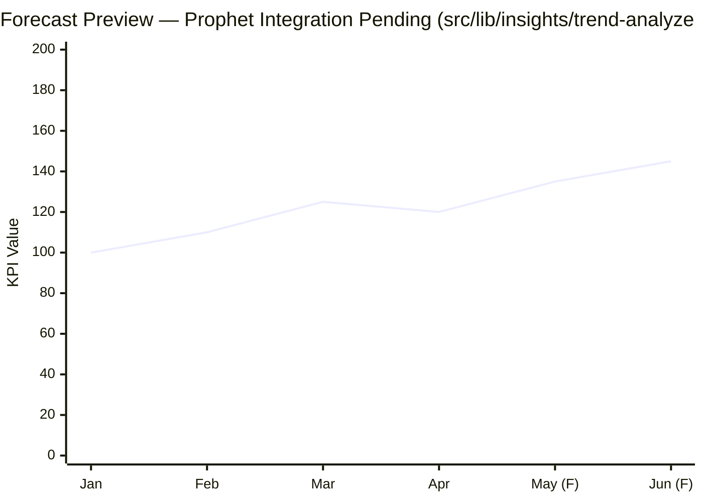

# Forecasting Graph (Prophet — Not Yet Implemented)

This forecasting visualization represents the intended integration of the Prophet engine, showing predicted trends and confidence intervals for a key business metric.

**Text-to-Image Prompt:**
> A professional line chart showing a business KPI's historical and predicted performance. The line chart has two segments: a solid blue line for "Historical Data (Actuals)" and a dashed blue line for "Predicted Trend (Forecast)". A light blue shaded band around the dashed line represents "Confidence Intervals (95%)". The chart is labeled "Forecast Preview — Prophet Integration Pending". Clean, high-tech, minimalist aesthetic with a clear legend.

*Note: The chart represents a mockup of Prophet's predicted output (yhat). The actual Prophet integration is currently a planned enhancement for the trend-analyzer module.*
