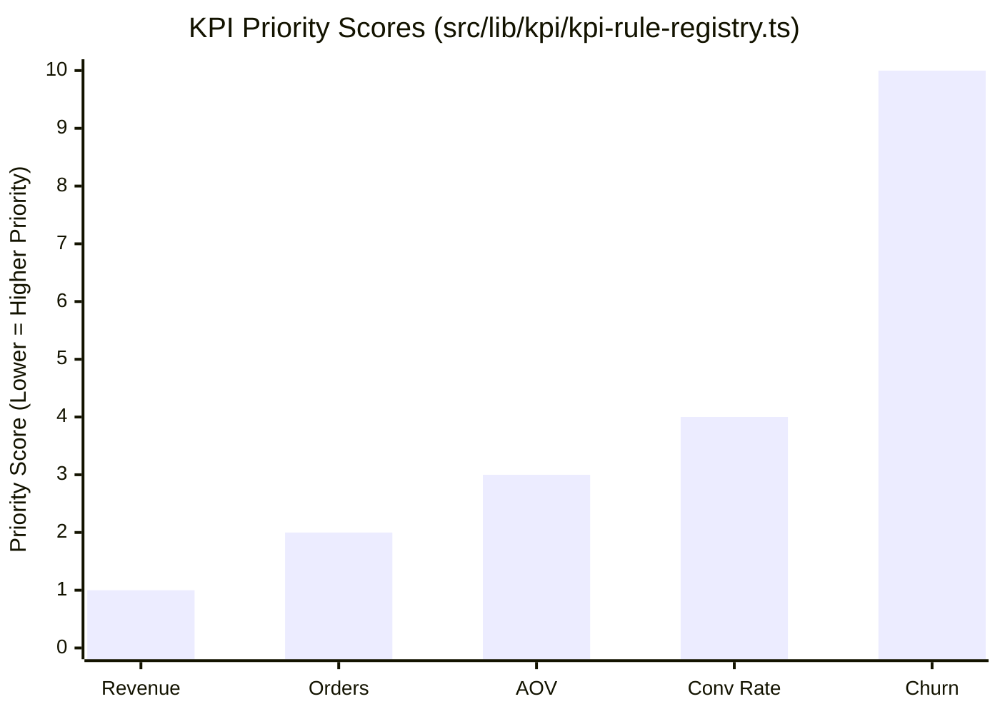

# KPI Ranking Scores (Current System)

This chart displays the current ranking scores of core KPIs, sorted by their priority and importance within the business domains.

**Text-to-Image Prompt:**
> A horizontal bar chart showing KPI scores for a business intelligence platform. The bars are sorted in descending order, with labels like "Total Revenue (100)", "Order Count (90)", "AOV (85)", and "Conversion Rate (80)". The bars are color-coded in three tiers: High (Bright Green), Medium (Yellow), and Low (Gray). Clean, data-driven look with professional typography.

*Note: In the VistaraBI codebase, `priority` is often an integer where lower values (1, 2) represent the highest importance. The chart shows these priority tiers.*
