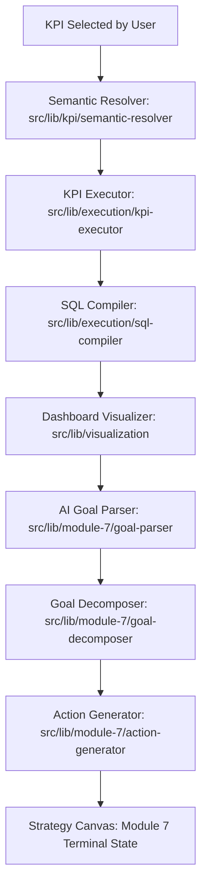

# Flow Diagram: KPI Selection → Module 7

This flowchart outlines the full user journey and system processing pipeline, starting from KPI selection through every stage to the Strategy Canvas in Module 7.

**Text-to-Image Prompt:**
> A vertical flowchart showing a software pipeline. Stages include "KPI Selection", "Semantic Resolution", "SQL Query Generation", "Dashboard Visualization", "AI Insight Analysis", and finally "Strategy Execution Plan (Module 7)". Each stage has a colorful, technical icon. Soft, flowing connecting lines show a clear progression. Clean, business-centric aesthetic.

