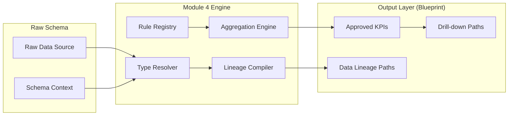

# Module 4: KPI Reasoning & Data Lineage

This diagram details how VistaraBI transforms raw, domain-specific data into a structured semantic layer of KPIs.

```mermaid
graph LR
    subgraph "Raw Schema"
        RDS[Raw Data Source]
        SC[Schema Context]
    end

    subgraph "Module 4 Engine"
        RR[Rule Registry]
        TR[Type Resolver]
        LC[Lineage Compiler]
        AG[Aggregation Engine]
    end

    subgraph "Output Layer (Blueprint)"
        KPI[Approved KPIs]
        LINEAGE[Data Lineage Paths]
        DRILL[Drill-down Paths]
    end

    RDS --> TR
    SC --> TR
    RR --> AG
    TR --> LC
    LC --> LINEAGE
    AG --> KPI
    KPI --> DRILL
```
