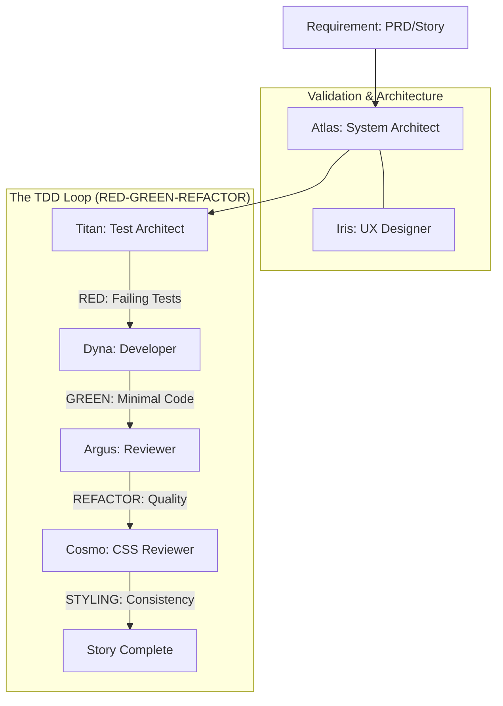

# SAM: Autonomous TDD Workflow

This diagram illustrates the SAM (Smart Agent Manager) workflow, orchestrating specialized AI agents through the RED-GREEN-REFACTOR TDD lifecycle.

```mermaid
graph TD
    PRD[Requirement: PRD/Story]

    subgraph "Validation & Architecture"
        Atlas[Atlas: System Architect]
        Iris[Iris: UX Designer]
        Atlas --- Iris
    end

    subgraph "The TDD Loop (RED-GREEN-REFACTOR)"
        Titan[Titan: Test Architect]
        Dyna[Dyna: Developer]
        Argus[Argus: Reviewer]
        Cosmo[Cosmo: CSS Reviewer]

        Titan -->|RED: Failing Tests| Dyna
        Dyna -->|GREEN: Minimal Code| Argus
        Argus -->|REFACTOR: Quality| Cosmo
        Cosmo -->|STYLING: Consistency| Finish[Story Complete]
    end

    PRD --> Atlas
    Atlas --> Titan
```
