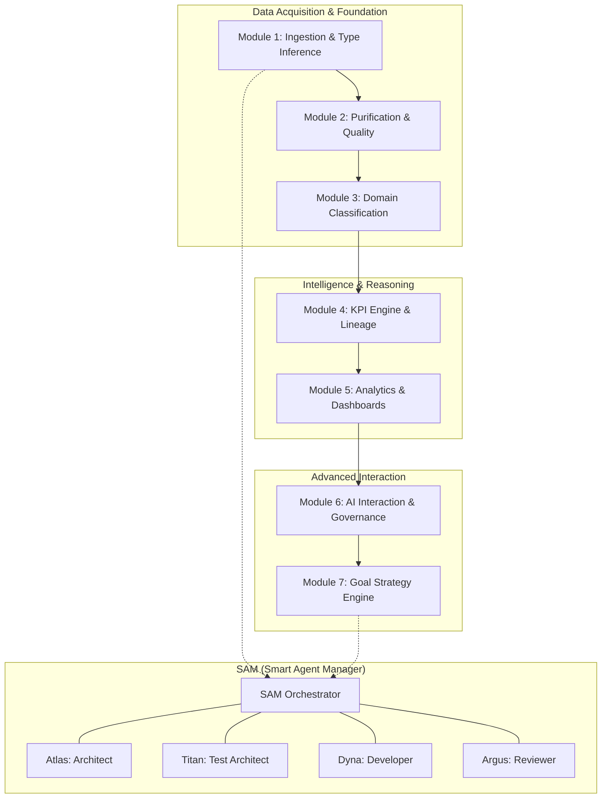

# VistaraBI System Architecture

This diagram illustrates the high-level flow of the VistaraBI platform, from raw data ingestion to the prescription of strategic business goals.

```mermaid
graph TD
    subgraph "Data Acquisition & Foundation"
        M1[Module 1: Ingestion & Type Inference] --> M2[Module 2: Purification & Quality]
        M2 --> M3[Module 3: Domain Classification]
    end

    subgraph "Intelligence & Reasoning"
        M3 --> M4[Module 4: KPI Engine & Lineage]
        M4 --> M5[Module 5: Analytics & Dashboards]
    end

    subgraph "Advanced Interaction"
        M5 --> M6[Module 6: AI Interaction & Governance]
        M6 --> M7[Module 7: Goal Strategy Engine]
    end

    subgraph "SAM (Smart Agent Manager)"
        SAM[SAM Orchestrator] --- Atlas[Atlas: Architect]
        SAM --- Titan[Titan: Test Architect]
        SAM --- Dyna[Dyna: Developer]
        SAM --- Argus[Argus: Reviewer]
    end

    M1 -.-> SAM
    M7 -.-> SAM
```
