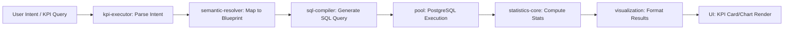

# Query Processing Pipeline

This flowchart traces the full lifecycle of a query within the VistaraBI engine, from user intent detection to SQL construction and final formatting.

**Text-to-Image Prompt:**
> A technical swimlane diagram or detailed flowchart showing the "Query Processing Pipeline". Stages are "User Intent Detection", "Semantic Blueprint Parsing", "SQL Generation", "Data Fetching", "Post-Processing/Formatting". Show data structures like JSON and SQL code passing between stages. Clean, high-tech, business dashboard aesthetic with vibrant connecting lines.

