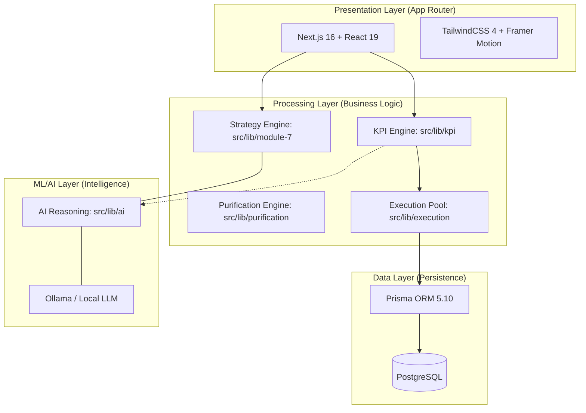

# Architecture of VistaraBI

This diagram illustrates the full system architecture of VistaraBI, from the frontend layers to the AI-driven processing and database.

**Text-to-Image Prompt:**
> A professional, modern software architecture diagram for an AI Business Intelligence platform called "VistaraBI". The diagram should be organized into four distinct layers: Presentation (Next.js, Tailwind), Processing (Business Logic, KPI Engine), Data (PostgreSQL, Prisma), and ML/AI (Ollama, Local LLM). Use clean, technical icons and glowing connecting lines to show data flow. The style should be high-tech, minimalist, with a dark theme and teal/blue accents.

