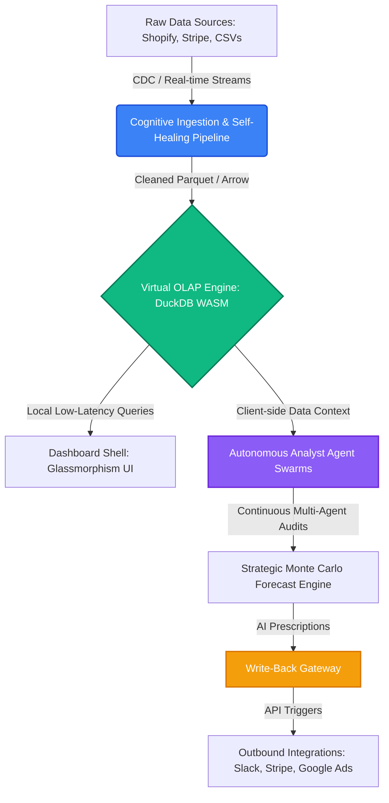
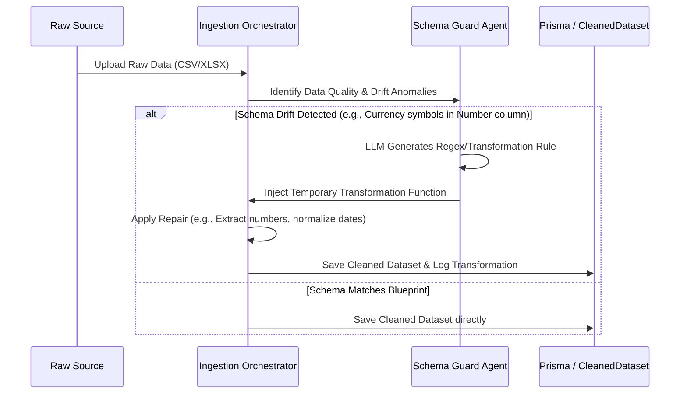
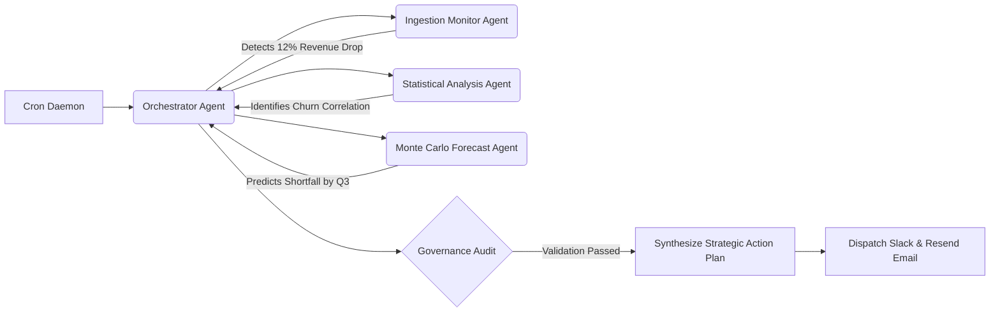
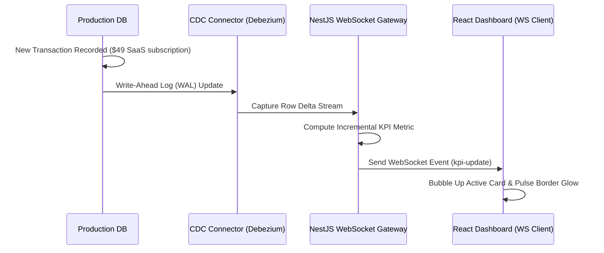
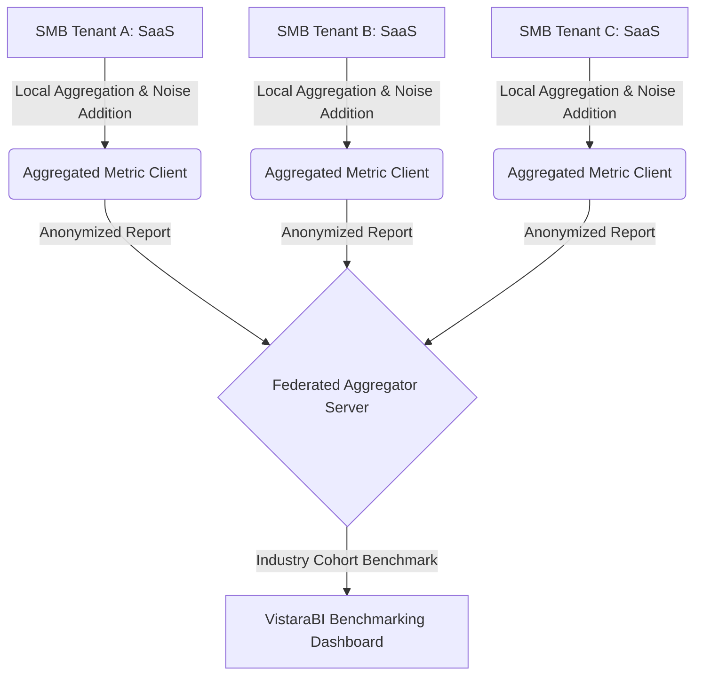

# VistaraBI — Next-Gen Architecture & Future Scope Blueprint
## Transitioning from Predictive Analytics to Autonomous Business Decision Engines

As business intelligence evolves, static visualization tools and reactive dashboards are becoming legacy paradigms. For Small and Medium-Sized Businesses (SMBs) to remain competitive, they must bypass manual data modeling and transition to **autonomous, self-correcting, and action-oriented intelligence systems**. 

This blueprint outlines the architecture, data flows, and technical implementation strategies for the future of VistaraBI.

---



---

## 1. Cognitive Self-Healing Data Pipelines (AI-Driven ETL/ELT)

### The Problem
Traditional data pipelines break when raw files experience **schema drift** (e.g., a currency symbol added to numeric columns, date formats shifting from `MM/DD/YYYY` to `DD-MM-YYYY`, or unexpected null strings like `"N/A"` or `"null"`). For SMBs without dedicated data engineers, a broken pipeline halts business operations.

### The Next-Gen Solution
Integrate a **Cognitive Repair Daemon** into the ingestion pipeline (`/src/lib/parsers/` and `/src/lib/purification/`).



### Technical Specification
*   **Automatic Regular Expression Synthesis**: If type inference fails to resolve a column, a lightweight local LLM (running via Ollama) evaluates a sample of 10 rows and outputs a cleaning blueprint:
    ```json
    {
      "column": "Monthly_Recurring_Revenue",
      "issue": "String values containing currency symbols and commas",
      "regex_strip": "[^0-9.]",
      "target_type": "NUMBER",
      "imputation_strategy": "interpolate"
    }
    ```
*   **Dynamic Code Injection**: The orchestrator dynamically builds and caches a cleaning middleware function using the generated regex, purifying incoming streams in real-time without crash-interrupting the dashboard.
*   **Data Lineage Audit Panel**: Provide the user with a visual audit panel showing exactly how raw data was repaired:
    > [!IMPORTANT]
    > **Transformation Audit Example:**
    > Column `Subscription_Cost` was inferred as `STRING` due to prefix `$` and commas (e.g. `$1,200.00`). The cognitive pipeline stripped non-numeric elements, cast to `FLOAT`, and marked the column health as `Grade: A- (Auto-Repaired)`.

---

## 2. Zero-Latency Client-Side Analytics (DuckDB WASM & Apache Arrow)

### The Problem
Traditional BI requires constant server queries for aggregation and filtering (OLAP). In high-volume environments, this introduces significant latency, increases server costs, and compromises data privacy.

### The Next-Gen Solution
Deploy **DuckDB WASM** directly in the client browser. Rather than sending database queries back to the PostgreSQL database, the browser acts as a high-performance analytics warehouse.

```
+-------------------------------------------------------------+
|                     Client Browser                          |
|                                                             |
|   +-------------------+          +-----------------------+  |
|   | Dashboard UI      |          | DuckDB WebAssembly    |  |
|   | (Next.js React)   |<-------->| (In-Memory Database)  |  |
|   +-------------------+          +-----------------------+  |
|                                              ^              |
|                                              | (Fast Load)  |
|                                              v              |
|                                  +-----------------------+  |
|                                  | IndexedDB / Parquet   |  |
|                                  +-----------------------+  |
+-------------------------------------------------------------+
```

### Technical Specification
*   **Arrow Stream Ingestion**: Cleaned datasets are serialized on the server into Apache Arrow or Parquet format (which compress data column-wise up to 90%) and sent to the browser.
*   **Local Aggregation**: When a user changes filters in the `FilterBar.tsx` (e.g., selecting date ranges, product categories, or customer segments), the dashboard executes a local SQL query inside the DuckDB WASM instance:
    ```sql
    SELECT 
        date_trunc('month', Date) as month,
        SUM(Revenue) as total_revenue,
        COUNT(DISTINCT CustomerID) as active_customers
    FROM cleaned_dataset
    WHERE Category = 'SaaS'
    GROUP BY month
    ORDER BY month ASC;
    ```
*   **Performance**: Aggregating 1,000,000 rows shifts from an asynchronous 2-second server wait time to an instantaneous `<10ms` local client computation, making dashboard cross-filtering feel completely live.

---

## 3. Autonomous AI Agent Swarms (Auto-Analyst Loops)

### The Problem
Business owners do not have time to actively browse dashboards looking for anomalies, correlation shifts, or forecasted targets. 

### The Next-Gen Solution
Transition from a **pull-model** (user opens dashboard) to a **push-model** (agents monitor background streams). Integrate a multi-agent coordinator system running continuously via cron triggers.



### The Agent Taxonomy
1.  **Orchestrator Agent**: Manages execution flow, delegates tasks, and synthesizes final insights.
2.  **Ingestion Monitor Agent**: Scans database updates, checks for anomalous spikes/drops, and updates the `anomalyCount`.
3.  **Statistical Analysis Agent**: Computes dynamic correlation matrices (e.g., Pearson’s r) between variables (e.g., correlating customer support response times with product churn).
4.  **Monte Carlo Forecast Agent**: Projects baseline forecasts 90 days out and runs random walk simulations to flag threshold breaches.
5.  **Governance Agent**: Evaluates the generated insights against hardcoded schema logic and database metrics to eliminate hallucinated percentages or dates.

---

## 4. Closed-Loop Action Engine (Write-Back Gateways)

### The Problem
Dashboards tell users *what* happened and *why*, but do not help them *act* on it. The user must manually log into other systems (e.g., Stripe, Shopify, Google Ads) to implement strategies.

### The Next-Gen Solution
Establish a secure, transactional **Write-Back Gateway** that allows owners to execute recommended strategies directly from the strategy simulator.

```
+-------------------------------------------------------------------------+
|                        VistaraBI Strategy Panel                         |
|                                                                         |
|  [Prescriptive Strategy Card]                                           |
|  "Google Ads conversion efficiency dropped. Budget shift recommended."  |
|                                                                         |
|  [Shift 20% Budget from Campaign A to Campaign B]   <-- Action Button   |
+-------------------------------------------------------------------------+
                                    |
                                    v (POST /api/v1/action/execute)
+-------------------------------------------------------------------------+
|                           Write-Back Gateway                            |
|                                                                         |
|   1. Verify Token & Session RLS (Row-Level Security)                    |
|   2. Execute Meta / Google Ads OAuth Connector                         |
|   3. Log Strategic Audit Trail (Action executed by User on 2026-06-08)  |
+-------------------------------------------------------------------------+
```

### Action Payload Schema
When an AI agent or forecasting engine recommends a strategy, it attaches a structured JSON payload containing the required endpoint, target system, parameters, and confirmation warning:
```json
{
  "actionId": "act-goog-ads-reallocate-982",
  "system": "GOOGLE_ADS",
  "endpoint": "/v15/campaigns:mutate",
  "payload": {
    "campaignId_source": "camp-882739",
    "campaignId_target": "camp-443912",
    "budget_delta_percent": 20.0
  },
  "justification": "Campaign B is converting at a 3.2x higher rate with a Pearson r correlation of 0.81 relative to core MRR expansion.",
  "requires_approval": true
}
```

---

## 5. Real-Time Change Data Capture (CDC) & Reactive Streams

### The Problem
Batch uploads are slow and make metrics historical rather than immediate. 

### The Next-Gen Solution
Connect VistaraBI to client production databases using **Change Data Capture (CDC)** (e.g., PostgreSQL Logical Replication via Debezium or Prisma pulse) streaming directly over **WebSockets**.



### Dynamic Dashboard Priority Sorting
When a WebSocket event signals an anomaly (e.g., server logs detect a 400% spike in error rates), the dashboard client immediately recalculates priority sorting. The affected metric card slides to the top-left slot of the dashboard layout using a smooth, premium CSS animation, drawing the user's attention instantly.

---

## 6. Zero-Knowledge Benchmarking & Privacy-Preserving Analytics

### The Problem
SMBs want to compare their growth rate, retention, and performance metrics against industry averages. However, they are highly sensitive about sharing their raw transaction databases, customer lists, or proprietary financial records.

### The Next-Gen Solution
Implement a **Privacy-Preserving Federated Analytics Engine** using Zero-Knowledge Proofs (ZKP) or secure Multi-Party Computation (SMPC).



### Technical Specification
*   **Differential Privacy (Local DP)**: Before metrics are sent to the central benchmarking server, mathematical noise (e.g., Laplacian noise) is added to the metrics.
*   **Secure Aggregation**: The central server can calculate accurate averages and percentiles across thousands of SaaS or Retail businesses in the same region, but is mathematically blocked from reverse-engineering the exact revenue or customer count of any individual tenant.

---

## 7. Next-Gen Engineering Implementation Roadmap

| Phase | Feature Focus | Technical Stack | Performance / Security Impact | Feasibility (1-5) | Priority |
|---|---|---|---|---|---|
| **Phase 1** | Client-Side OLAP Integration | DuckDB WASM, Apache Arrow, IndexedDB | Dashboard filters load in `<10ms` instead of `~2s`. Server load drops by 90%. | 5 / 5 | 🔥 Critical |
| **Phase 2** | Cognitive ETL & Schema Repair | Lightweight LLM Parser, Regex generator, Prisma | Prevents ingestion crashes from schema drift; reduces setup friction. | 4 / 5 | High |
| **Phase 3** | Write-Back Gateway & API Connectors | OAuth2, Axios, Encrypted API Key Storage | Bridges the gap between static analytics and actual business execution. | 3 / 5 | Medium |
| **Phase 4** | CDC WebSockets Streaming | PostgreSQL logical replication, Server-Sent Events | Visual charts update live; active alerts update instantly. | 3 / 5 | Medium |
| **Phase 5** | Privacy-Preserving Benchmarks | Diff Privacy libraries, SMPC server | Safe, anonymized industry benchmark comparisons. | 2 / 5 | Low |

---

## 8. Conclusion: The Unified Vision

The future of VistaraBI lies in breaking down the barriers between raw data and immediate action. By combining **client-side database virtualization (DuckDB WASM)**, **proactive analyst agents**, and **closed-loop write-back systems**, VistaraBI will empower SMBs to act with the speed and data sophistication of global enterprises—without requiring specialized engineering resources or expensive cloud infrastructure.
